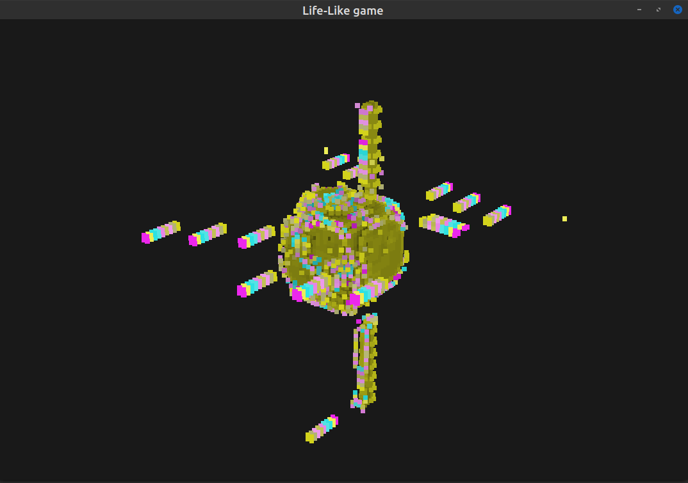

# Life-like games


This is a simple project written in **c++** and modern **OpenGL** to visualize some rules of the **life-like games**, that is 3D *totalistic* (isotropic) cellular automata. The code is highly unoptimized and can renderer at most grid with sides 50/60 before starting to lag, but still manages to show the behavior of the rule chosen.
This code is intended to explore a couple of rules, mostly copied from [here](https://softologyblog.wordpress.com/2019/12/28/3d-cellular-automata-3/).

### Some observations
If you scroll through the code you will find that simulation parameters are specified via the following *component*:
```cpp
struct Simulation
{
	[...]
	int 	mN;
	float 	mProbability;
	[...]
};
```
the behavior of the automaton is very sensible to changes of these two parameters:
1. ```mN``` is the size of the grid. Notice that the rule specifies the *local* behavior of the automaton, so we cannot expect that the small scale structure of the simulation will grow or shrink according to this parameter;
2. ```mProbability``` is used to produce the initial condition of the simulation, and even small deviations from its ideal value may cause life to disappear quickly;

Besides in all the simulations I have used:
1. *periodic boundary conditions*, that is the space is wrapped into itself;
2. an *L infinity* distance neighborhood. Using another norm would completely change the dynamics of the automata;

### Gallery

##### Clouds 1
This automata most of the time converges to a steady state configuration. Its particular behavoiur makes it ideal as a starting point for a cave generation algorithm:


Notice that according to observation 1 above, if you want to generate a big cave you may want to:

1. generate the cave with a small enough size;
2. divide the grid;
3. run a second, *smoothing*, automaton, that preserves large scale structure;
4. feed everything to your marching cubes implementation;
##### Spiky growth



##### Pyroclastic
In the dying phase:


##### Misc
A cube in construction:

An almost complete cube with some oscillatory dynamics along the edges:

A space station with its fleet:

The international space station:


Two v formations:

